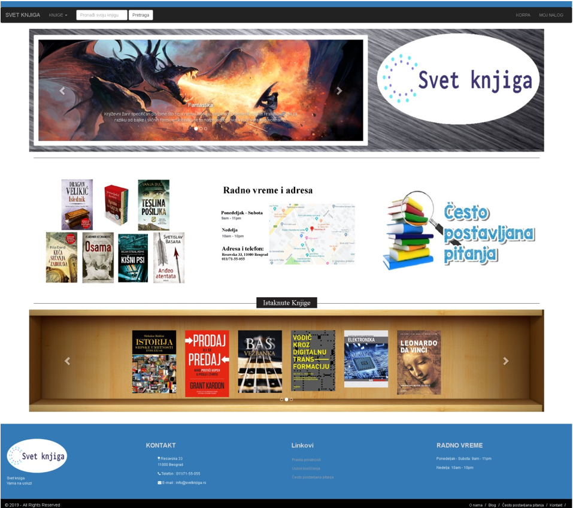
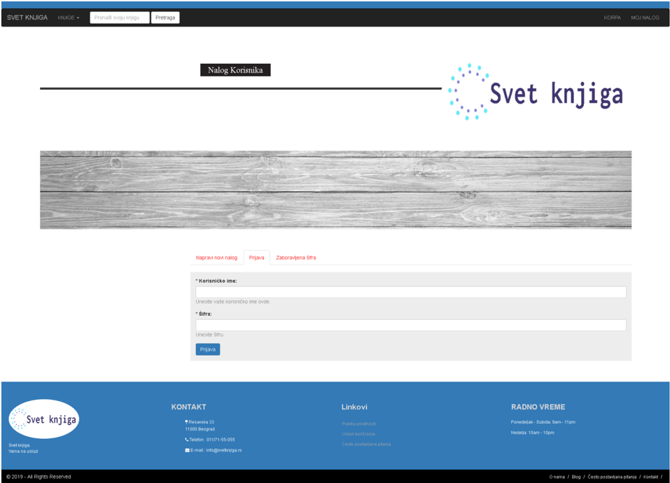

# Bookstore - User interface

This is an e-commerce web application built by me while covering the 
[udemy](https://www.udemy.com/complete-e-commerce-course-javaspringhibernate-and-mysql/)
course using Java,Spring,Hibernate and MySQL. Bookstore is a simple Java Spring Boot application to store and sell books.
 The project was built focusing the MVC pattern. It is divided into two
 individual modules, [admin](https://github.com/bromazepam/adminportal) and
user part. Both running independently and using the same database. 
 
 ## Built With
 
 * [Java 1.8](https://www.oracle.com/technetwork/java/javaee/downloads/jdk8-downloads-2133151.html)
 * [Spring Boot](https://spring.io/projects/spring-boot)
 * [Maven](https://maven.apache.org/)
 * [Thymeleaf](https://www.thymeleaf.org/)
 * [MySQL](https://www.mysql.com/)
 * [JPA](https://spring.io/guides/gs/accessing-data-jpa/)
 * [Hibernate](https://hibernate.org/)
 
 # Functionality

 * User Signup, Login and Forgotten password
 * User Profile management
 * Product management
 * Shopping Cart
 * Order checkout and order history
 * Automatic email confirmation

 
 ## Running the application locally
 
 There are several ways to run a Spring Boot application on your local machine. One way is to execute the `main` method in the `com\bookstore\BookstoreApplication.java` class from your IDE.
 
 Alternatively you can use the [Spring Boot Maven plugin](https://docs.spring.io/spring-boot/docs/current/reference/html/build-tool-plugins-maven-plugin.html) like so:
 
 ```shell
 mvn spring-boot:run
 ```

By default, the app runs on port: `8080`. You can open up the admin ui from following url: `http://localhost:8080`.
Login credentials are user: `user`, password: `user`
## Application screenshots


*landing page*


*login page*
